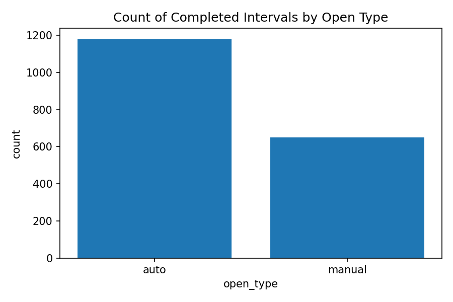
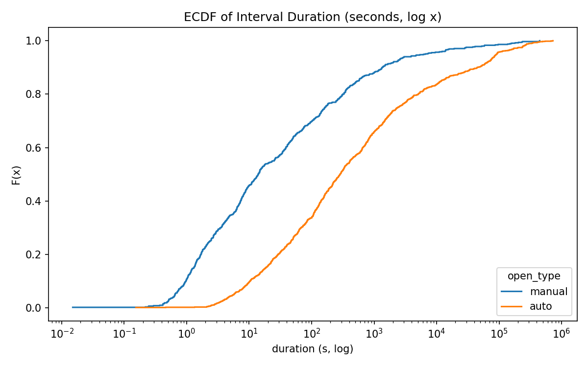
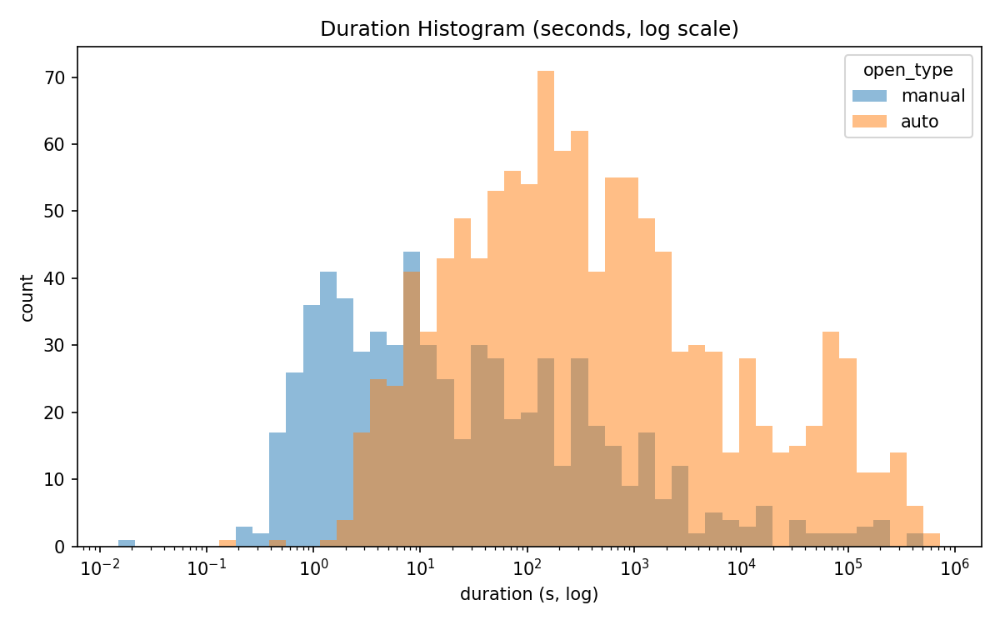
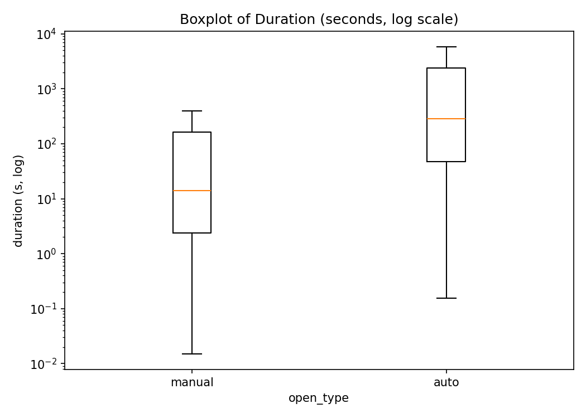

# Tool Window Usage Analysis (JetBrains Internship Task)

This project analyzes tool window usage patterns in JetBrains IDEs, focusing on
whether a tool window stays open longer when it is opened **manually** (user action)
or **automatically** (IDE-triggered event such as debugging or test failure).

The project originated as a **technical take-home assignment** for the  
**JetBrains “Analytics for Data Products – IDEs” internship**.

After receiving feedback, this repository contains an **improved version** of
the original solution, including additional **statistical testing**, cleaner
documentation, and a more polished analysis pipeline.

---

## Background: JetBrains Task Summary

JetBrains asked candidates to analyze real IDE telemetry and answer:

> **Do manually opened tool windows behave differently from automatically opened ones?**

The dataset included events like:

- `user_id`
- `timestamp` (epoch ms)
- `event_id`: `"open"` or `"close"`
- `open_type`: `"manual"` or `"auto"`

The analysis required:

- Cleaning messy real-world logs
- Reconstructing tool window open/close intervals
- Computing durations
- Comparing manual vs auto opens
- Testing whether differences are statistically significant
- Producing summary statistics and visualizations
- Writing a short analysis summary

<details>
<summary><strong>Click to view the full task description</strong></summary>

(Insert your long task text here exactly as provided.)

</details>

---

## What This Repository Contains

- **A clean Python analysis pipeline** (`main.py`)
- **Interval reconstruction logic** with:
    - Orphan close handling
    - Multiple-open implicit closures
    - Right-censored intervals
- **Duration statistics per open_type**
- **Formal statistical test** (Welch t-test on log durations)
- **Transition analysis** (what gets opened after an implicit close)
- **Visualizations** (saved as PNGs)
- **Synthetic example CSV** (optional)

The real JetBrains dataset is **not included**, but the code and example data
allow the full pipeline to be run.

---

## Improvements Made After Feedback

JetBrains provided helpful feedback:

> *“Your analysis showed solid data handling and clear reasoning.  
> For future analytics work, consider including statistical tests to formally assess differences.”*

This version adds:

- ✔ **Welch’s t-test** on log-transformed durations
- ✔ Effect-size estimation (auto/manual duration ratio)
- ✔ Clearer interval logic docstrings
- ✔ More polished visualizations
- ✔ Readme documentation + task summary

---

## Key Results (Based on the Provided Dataset)

### Completed Intervals

- **Auto opens:** 1,180
- **Manual opens:** 651

### Duration Comparison

| Metric          | Manual      | Auto         |
|-----------------|-------------|--------------|
| Median duration | ~14 seconds | ~285 seconds |
| Mean duration   | ~4.6M ms    | ~17.5M ms    |
| Variability     | Lower       | Much higher  |

### Statistical Significance

- Welch t-test on log durations:  
  **t ≈ 19.33, p ≈ 1.2 × 10⁻⁷³**
- Estimated mean ratio:  
  **Auto durations ≈ 16× longer than manual**

➡ **Conclusion:**  
Auto-opened tool windows stay open **dramatically longer**, with a highly statistically significant difference.

---

## Visualizations

These plots were generated by the real dataset and saved in the repo:

### 1. Count of Completed Intervals



### 2. ECDF of Durations



### 3. Histogram (log-scale)



### 4. Log-scale Boxplot



---

## Running the Analysis

### Requirements

- Python 3.9+
- Install dependencies from `requirements.txt`:

```bash
pip install -r requirements.txt

